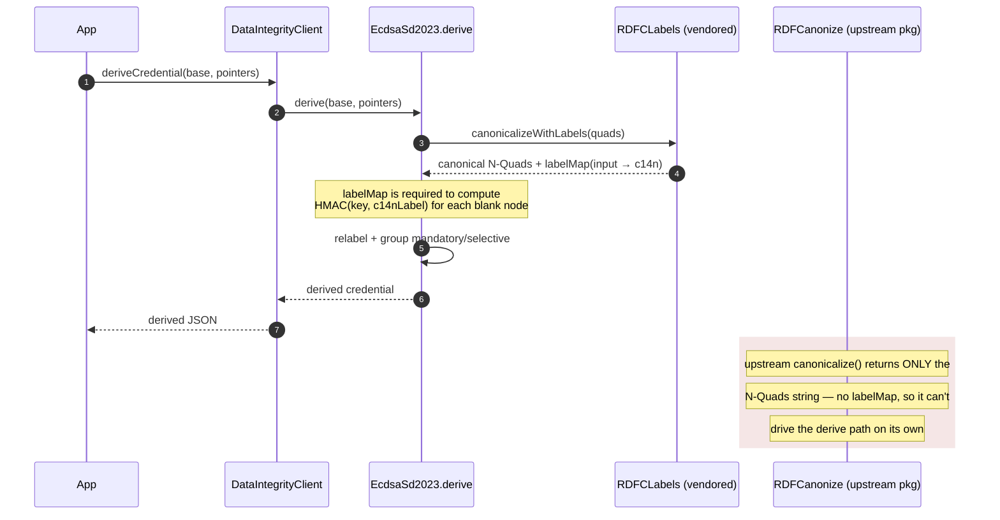
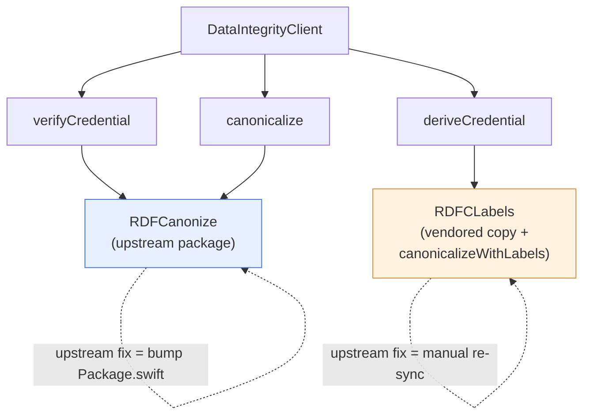
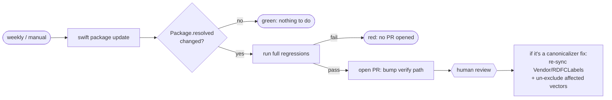

# ADR 0001 — Vendor a renamed copy of the RDF canonicalizer for selective disclosure

- **Status:** Accepted
- **Date:** 2026-06-30
- **Area:** `DataIntegrity` · `ecdsa-sd-2023` derive
- **Maintainer:** @jainhitesh9998

## Context

We verify and derive W3C Data Integrity proofs, and we canonicalize RDF with
[`Kingpin-Apps/swift-rdf-canonize`](https://github.com/Kingpin-Apps/swift-rdf-canonize)
(RDFC-1.0 / URDNA2015). For plain verification and standalone canonicalization,
that package is all we need — give it quads, get canonical N-Quads back.

Selective disclosure (`ecdsa-sd-2023`) is different. When the holder **derives** a
disclosure, the cryptosuite re-labels every blank node as `HMAC(key, c14nLabel)`.
To do that we need the **canonical blank-node label map** — the mapping from each
*input* blank-node label to the `_:c14nN` label the canonicalizer assigned it.

Here's the problem: `swift-rdf-canonize` **computes that map internally** but its
public API (`canonicalize(...)`) returns **only the final N-Quads string**. The
map isn't exposed, and you can't reconstruct it after the fact — it falls out of
the hashing/identifier-issuance order *inside* the algorithm. So to get it, you
either re-run the algorithm yourself, or reach into a copy of it.

## Decision

Vendor a **renamed copy** of `swift-rdf-canonize` under
`Sources/DataIntegrity/Vendor/RDFCLabels/` with exactly two changes:

1. rename the module namespace `RDFCanonize` → `RDFCLabels`, so the copy can
   **coexist in the same build** with the upstream package; and
2. add one function, `canonicalizeWithLabels(quads:)`, that returns the canonical
   output **and** the `input → c14n` label map.

Keep depending on the **upstream package directly** for verification and
standalone canonicalization. Only the **derive** path uses the vendored copy.

## Options we weighed

| Option | Correctness risk | Effort | Ongoing maintenance | Do upstream fixes reach us? | Verdict |
|---|---|---|---|---|---|
| **A. Reimplement URDNA2015 ourselves** | **High** — canonicalization is subtle (see `test075`) | High | High — we'd own a crypto-grade algorithm | Never (we diverge immediately) | ❌ Throws away a tested implementation |
| **B. Fork upstream to a separate repo** | Low | Medium | Medium — a repo + releases to keep alive | Manual (merge upstream) | ❌ Divergent dependency URL for every consumer |
| **C. Wait for upstream to expose the map** | Low | Low for us | Low | n/a | ❌ Blocks delivery on a maintainer's timeline |
| **D. Vendor renamed copy; keep upstream for verify** | Low — reuses upstream code verbatim | Low | Low–Medium — re-sync the *derive* copy only | **Verify: automatic** (version bump); Derive: manual re-sync | ✅ **Chosen** |
| **E. Vendor everything, drop the upstream dep** | Low | Low | Medium — re-sync *all* paths | Manual for everything | ⚠️ Loses auto-fix on the critical verify path |

The deciding factor between **D** and **E** was *blast radius*: verification is the
security-critical path almost every consumer hits, so we want it on the maintained
package where a fix is a one-line version bump. Derivation is holder-side and less
common, so it's the acceptable place to carry a frozen snapshot.

## How the two paths are wired

## How upstream fixes reach us (workflow)

This is automated as much as it safely can be. The weekly
`dependency-update` workflow refreshes dependencies, runs the **full regression
suite** (unit tests + RDFC-1.0 / JCS / Wycheproof conformance + iOS build), and
opens a PR **only if everything still passes**:

So a canonicalizer fix lands in two moves: the bot's PR bumps the dependency
(fixing the **verify** path automatically), and a maintainer re-syncs the vendored
copy per [`Vendor/RDFCLabels/NOTICE.md`](../../Sources/DataIntegrity/Vendor/RDFCLabels/NOTICE.md)
(fixing the **derive** path). Conformance for both paths is reported daily by the
`conformance` workflow.

## Consequences

**Positive**
- Reuses the exact, tested upstream algorithm — no re-implementation risk.
- The critical verify path stays on the maintained package and gets fixes via a
  normal version bump.
- Self-contained: no extra fork repo, no divergent dependency URL.
- License-clean: the copy is MIT and preserves the upstream `LICENSE` plus a
  `NOTICE.md` listing the changes.

**Negative / costs**
- Two copies of the canonicalizer live in the build.
- The derive copy is a **frozen snapshot** (currently upstream `0.2.2`) and must be
  re-synced by hand when a relevant upstream fix ships — a real risk of version
  skew between the verify and derive paths if that step is skipped.

**Exit criteria**
- If upstream exposes a public accessor for the canonical id map — ideally via a PR
  *we* open — we **delete the vendored copy** and use the dependency for derive too.
  At that point a single version bump fixes every path, and this ADR is superseded.
