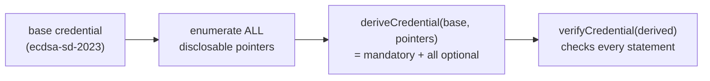
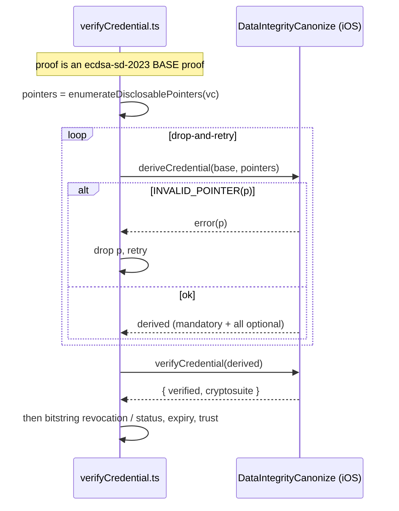

# Selective disclosure — verifying every statement on open

How to use `ecdsa-sd-2023` derivation so that **opening/verifying a credential
checks every signed statement**, robustly across the wildly different shapes real
credentials take (deep nesting, arrays of objects, keyword fields, big render
methods). This is **app-side guidance** — the library API doesn't change.

## 1. The model — why "verify everything" means "derive all optional"

An `ecdsa-sd-2023` **base proof** (the one the issuer signs) actually signs two
different things:

- the **mandatory** statements, *collectively* — one base signature over their
  combined hash; and
- **each** selectively-disclosable statement, *individually* — a per-statement
  signature under an ephemeral key.

A holder never presents the base proof as-is. They **derive** a disclosure:
choose which optional statements to reveal, and the library emits a **derived
proof**. When that derived proof is verified, the verifier checks:

1. the **base signature** → covers all mandatory statements, and
2. the **per-statement signature for each *disclosed* statement**.

> **Therefore a statement is cryptographically verified only if it is mandatory
> (always) or disclosed.** Undisclosed optional statements are simply absent —
> not checked, and not failed.

So for **verify-on-open** ("is this whole credential authentic?") you must
**derive revealing _all_ optional statements**. A mandatory-only derivation
verifies only the mandatory subset — a tampered *optional* field would slip
through. (That was the latent bug: a broken pointer enumerator threw, the code
fell back to `derive(base, [])`, and silently under-verified every credential.)

Two failure modes follow directly from the two-layer signing — and they fail in
**different places**, which is a useful sanity check:

- tampering a **mandatory** field → the **base signature** fails
  (*"base signature did not verify against the issuer key"*);
- tampering a **disclosed optional** field → that statement's **per-statement
  signature** fails (*"non-mandatory statement signature #N did not verify"*).

Both are exercised in `DriverLicenseSdTests` (a mandatory `fullName` tamper and an
optional `licenseNumber` tamper, each correctly rejected).



## 2. Mandatory vs optional — and what the app needs to know

- **Mandatory** pointers are baked into the base proof **by the issuer**. The
  verifier reads them from the proof itself.
- **Optional** = everything else that's selectively disclosable.
- **The app does NOT need to know the mandatory set.** Including mandatory-covered
  pointers in your `selectivePointers` is **harmless** — the library always
  includes mandatory and de-duplicates the overlap.

This is verified empirically against a real, deeply-nested credential (the NREMT
badge): the issuer marked only `/issuer` mandatory; passing **only** the 51
non-mandatory leaf pointers and passing **all 54** (including the `/issuer`
subtree) both produce `verified: true`. So you can simply enumerate *everything
disclosable* and pass it — no need to parse the base proof for its mandatory list.

## 3. The enumeration algorithm (the right approach)

Walk the credential (minus `proof`) and emit one JSON Pointer (RFC 6901) per
disclosable leaf:

- **object** → recurse into each key;
- **array** → recurse into each element by index (`/renderMethod/0/...`) — real
  arrays are indexable;
- **scalar** → emit the leaf pointer;
- **`type` / `@type`** → emit the **node** pointer (`/credentialSubject/type`),
  **never index it** (`/credentialSubject/type/0`). A single-valued `type` array
  compacts to a scalar in the JSON-LD model the verifier resolves against, so an
  index pointer doesn't resolve → `INVALID_POINTER`. (This was the exact
  `/issuer/type/0` failure.)
- escape keys per RFC 6901 (`~` → `~0`, `/` → `~1`).

```ts
function enumerateDisclosablePointers(doc: any): string[] {
  const out: string[] = [];
  const esc = (k: string) => k.replace(/~/g, "~0").replace(/\//g, "~1");
  const walk = (v: any, prefix: string) => {
    if (Array.isArray(v)) {
      if (v.length === 0) out.push(prefix);
      else v.forEach((e, i) => walk(e, `${prefix}/${i}`));
    } else if (v && typeof v === "object") {
      for (const k of Object.keys(v)) {
        const p = `${prefix}/${esc(k)}`;
        if (k === "type" || k === "@type") out.push(p);   // disclose the node, never /type/0
        else walk(v[k], p);
      }
    } else {
      out.push(prefix);                                    // scalar leaf
    }
  };
  // Skip `@context` (JSON-LD framing — produces no statements) and `proof`.
  const { proof, "@context": _ctx, ...claims } = doc;
  walk(claims, "");
  return out;
}
```

### What counts as a disclosable statement (and why `@context` isn't "optional")

Selective disclosure operates on **RDF statements** — the N-Quads the credential
canonicalizes to — **not on raw JSON keys**. So the mandatory/optional split only
applies to things that *become statements*:

- **Data claims** (`fullName`, `address`, `dateOfBirth`, …) → become N-Quads →
  each is mandatory or optional. These are what you enumerate and disclose.
- **`@context`** is JSON-LD *framing*: it maps terms to IRIs but produces **no
  N-Quads**. It is therefore **neither mandatory nor optional** — not a
  disclosable statement at all — and it's always kept in the derived credential
  (you need it to interpret the doc). Emitting `/@context/...` pointers is
  *harmless* (they select JSON that yields no statement — a no-op) but noisy, so
  the enumerator **skips `@context`**. (Earlier output that listed `/@context/1/*`
  as "optional" was exactly this enumerator artifact — not a real signed claim.)
- **`type` / `@type`** *does* produce a statement (an `rdf:type` triple), so it
  **is** a real disclosable statement — disclose it as a **node**
  (`/credentialSubject/type`), never indexed (`/credentialSubject/type/0`).

In short: enumerate the *claims*, not the JSON scaffolding.

## 4. Resilience — drop-and-retry

Credential shapes vary, and a `@context` may mark some single-valued arrays
`@container: @set` (stay arrays) and others not (compact to scalars). So treat the
enumerator as a *best guess* and let the verifier be the authority: if `derive`
rejects a pointer it can't resolve, **drop that one pointer and retry** — never
collapse straight to mandatory-only. Fall back to mandatory-only only if it truly
cannot converge.

```ts
async function deriveRevealingAll(baseJson: string): Promise<string> {
  let pointers = enumerateDisclosablePointers(JSON.parse(baseJson));
  for (;;) {
    try {
      return await NativeModules.DataIntegrityCanonize.deriveCredential(baseJson, pointers);
    } catch (e) {
      const bad = parseInvalidPointer(e);              // pull "/x/y" out of the INVALID_POINTER error
      if (!bad || !pointers.includes(bad)) throw e;    // unknown failure → bubble up, don't mask
      pointers = pointers.filter(p => p !== bad);
      if (pointers.length === 0) {
        return await NativeModules.DataIntegrityCanonize.deriveCredential(baseJson, []); // last resort
      }
    }
  }
}
```

## 5. App-side flow (verify-on-open)



Routing in `verifyCredential.ts`:

1. **`ecdsa-sd-2023` base proof** → `derived = deriveRevealingAll(vc)` → `verifyCredential(derived)` → then the existing revocation-status check.
2. **other `DataIntegrityProof`** (`ecdsa-rdfc-2019` / `ecdsa-jcs-2019` / `eddsa-*` / `Ed25519Signature2020`) → `verifyCredential` directly.
3. **legacy JWT / LinkedData suites** → unchanged.

## 6. Worked example — the NREMT First-Responder badge

| | |
|---|---|
| Mandatory pointers (from the base proof) | `/issuer` (1) |
| Optional leaf pointers enumerated | **51** — across `credentialSubject/badge/personHumanResource/personIDCard/*`, `experience/jobTitleOrRole/*`, `renderMethod/*`, `@context/*`, … |
| `derive(all 51 optional)` → `verify` | ✅ `verified: true` |
| `derive(all 54, incl. `/issuer` subtree)` → `verify` | ✅ `verified: true` (overlap harmless, nothing dropped) |

Every statement is cryptographically checked, and the enumerator needed **no**
drop-and-retry on this credential — the `type`-as-node rule was enough.

## 7. Recommended hardening (optional)

The most robust fix is to let the **library** — which owns the canonical pointer
model and the mandatory set — do the enumeration, e.g. a read-only
`disclosableOptionalPointers(base)` or a `deriveRevealingAll(base)` convenience.
That removes the app's dependence on guessing the verifier's JSON-LD model and
eliminates this class of bug entirely. The app-side algorithm above is the
working approach under the current "keep enumeration app-side" constraint; the
library helper is the cleaner long-term option if you want it.
